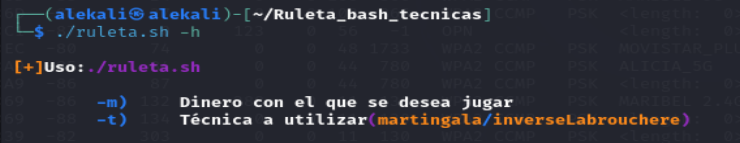
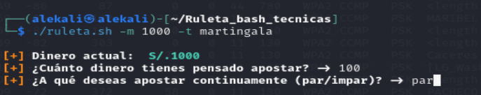
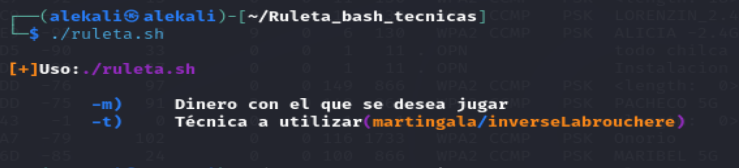

# 📌 Instalación y Uso del Script desde GitHub

## 📌 Descripción

Este script simula el juego de ruleta en el que un jugador apuesta utilizando dos estrategias populares: **Martingala** e **Inverse Labouchere**. Su propósito es analizar cómo varían las ganancias y pérdidas en función de estas estrategias.

---
### Información de Ejecución

## 🎲 Métodos de Juego

### 1️⃣ Martingala
La estrategia de **Martingala** consiste en doblar la apuesta tras cada pérdida, de modo que, cuando se gane, se recuperan todas las pérdidas previas junto con una ganancia equivalente a la apuesta inicial.  

**Explicación de Martingala:**  
[Explicación de Martingala](https://www.oddsshark.com/es/apuestas-deportivas/metodos-para-apostar/martingala)

### 2️⃣ Inverse Labouchere
La estrategia **Inverse Labouchere** consiste en sumar la cantidad apostada al sistema cuando se gana y reducirla cuando se pierde. Es una técnica más conservadora en comparación con la Martingala.  

**Explicación de Inverse Labouchere:**  
[Explicación de Inverse Labouchere](https://lvbet.com/casino-blog/es/ruleta/la-estrategia-labouchere-explicada/)

---

## 🚀 Instalación

Sigue estos pasos para clonar el repositorio y ejecutar el script en tu sistema.

### 1️⃣ Clonar el Repositorio

Abre una terminal y ejecuta:

```bash
git clone https://github.com/SwodLore/Ruleta_bash_tecnicas.git
```

📌 *Reemplaza `SwordLore` y `Ruleta_bash_tecnicas` por el nombre real de tu cuenta y repositorio.*

### 2️⃣ Acceder a la Carpeta del Proyecto

```bash
cd Ruleta_bash_tecnicas
```

### 3️⃣ Dar Permisos de Ejecución al Script

```bash
chmod +x ruleta.sh
```

---

## 📌 Uso del Script

### ▶️ Ejecutar el Script

```bash
./ruleta.sh
```

### 📌 Parámetros Disponibles

El script tiene las siguientes opciones:

Estos parámetros se pueden utilizar para personalizar el juego de ruleta:
```bash
./ruleta.sh -h
```


Estos parámetros se pueden utilizar para personalizar el juego de ruleta:
m = dinero inicial
t = técnica a utilizar (martingala o inverseLabrouchere)

```bash
./ruleta.sh -m 100 -t martingala
```
[Ejemplo de ejecución](./img/m_end.png)

Estos parámetros se pueden utilizar para personalizar el juego de ruleta:
m = dinero inicial
t = técnica a utilizar (martingala o inverseLabrouchere)
[Parametros de Ejecución](./img/i_start.png)
```bash
./ruleta.sh -m 100 -t inverseLabrouchere
```
[Ejemplo de ejecución](./img/i_end.png)

🔹 `-m`: Define el dinero inicial.
🔹 `-t`: Técnica a utilizar (`martingala` o `inverseLabrouchere`).
🔹 `-h`: Ayuda del script.

📸 **Ejemplo de ejecución en la terminal:**



---

## 📌 Actualizar el Script

Para obtener la última versión del script desde GitHub, usa:

```bash
git pull origin main
```

---

## 📌 Contribuir

Si deseas mejorar el script, puedes hacer lo siguiente:

1️⃣ Realizar un **fork** del repositorio en GitHub.  
2️⃣ Crear una nueva rama con la mejora o corrección:  
   ```bash
   git checkout -b mi_mejora
   ```
3️⃣ Realizar los cambios y hacer commit:
   ```bash
   git commit -m "Mejora en la lógica de apuestas"
   ```
4️⃣ Enviar los cambios a tu fork y crear un **Pull Request** en el repositorio principal.

📌 **Conclusión del script**

El juego de ruleta con estrategias puede dar la ilusión de control sobre las apuestas, pero en el largo plazo, la casa siempre tiene ventaja.

Si no salimos a tiempo cuando obtenemos una ganancia, terminamos perdiendo todo nuestro dinero debido a la racha de pérdidas que inevitablemente llegará. Esto ocurre especialmente en la estrategia Martingala, donde las apuestas se duplican rápidamente hasta alcanzar límites insostenibles.

📌 Lección clave: Si juegas con estrategias, define un límite de ganancia y de pérdida antes de empezar y respétalo. De lo contrario, el casino siempre ganará. 🎰

---

